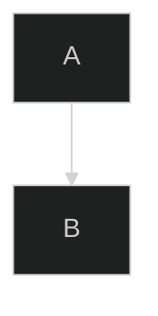
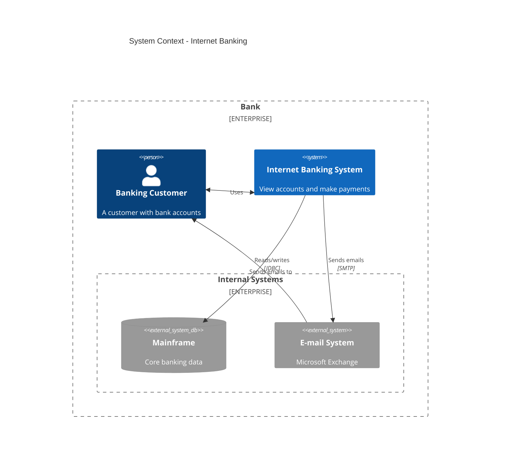
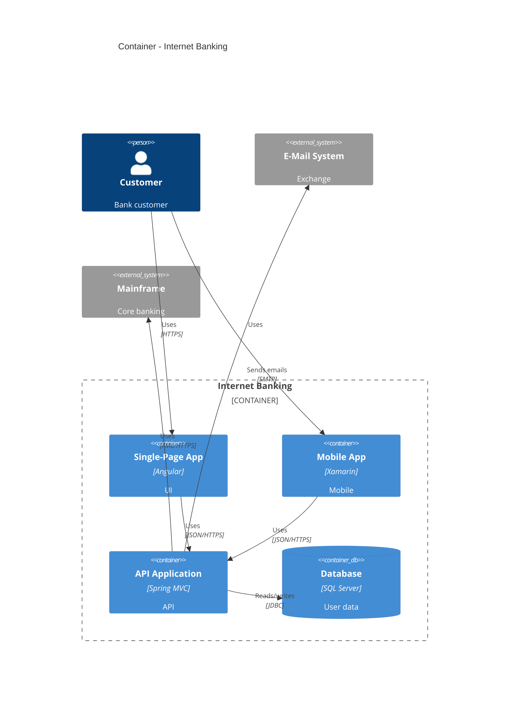
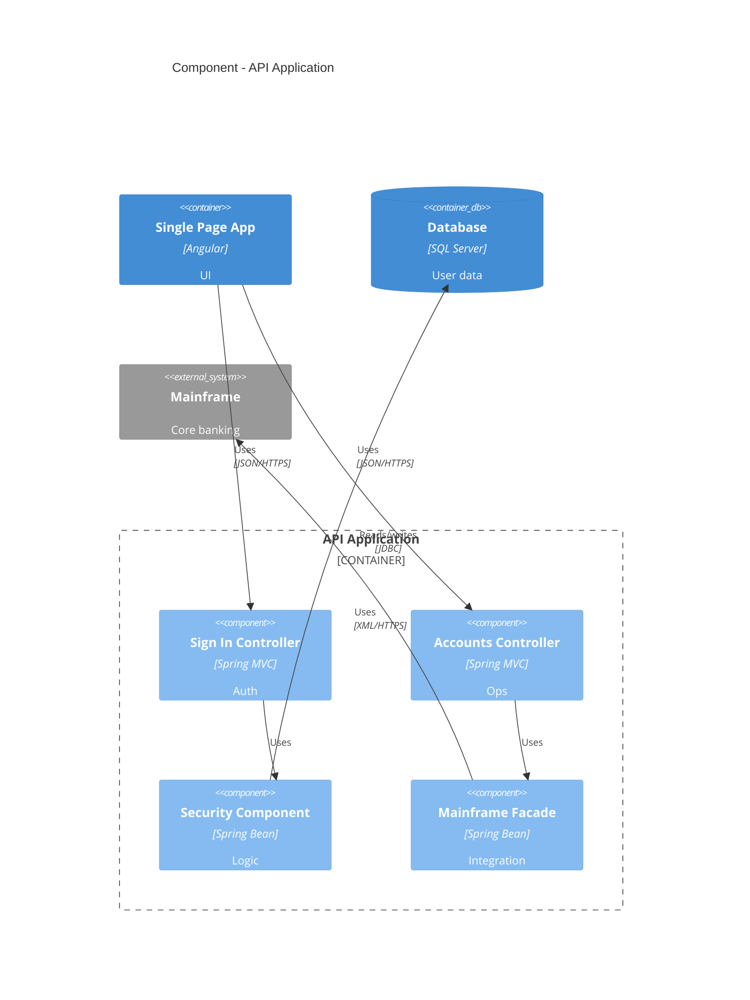
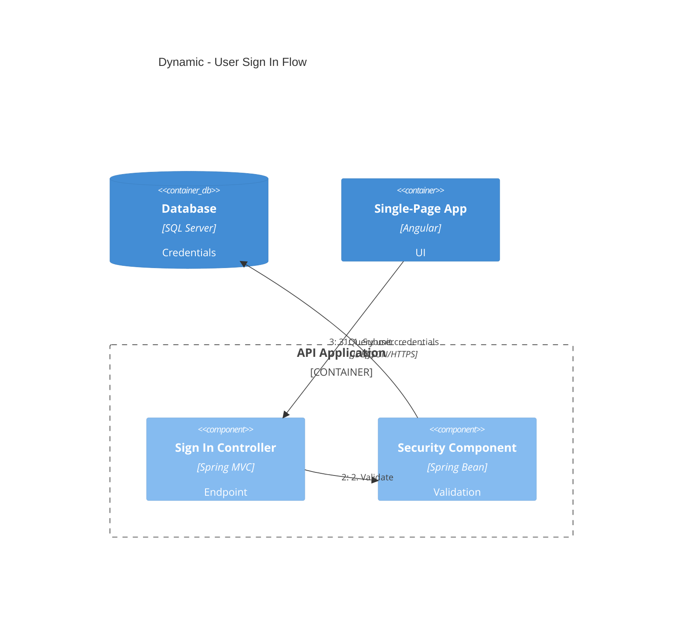
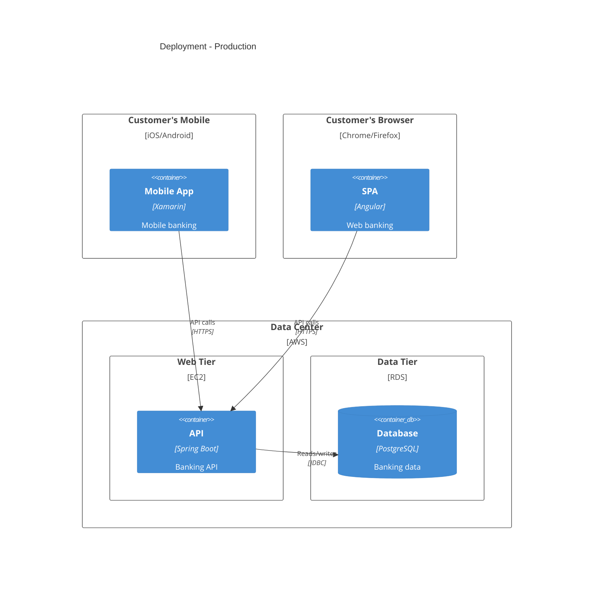
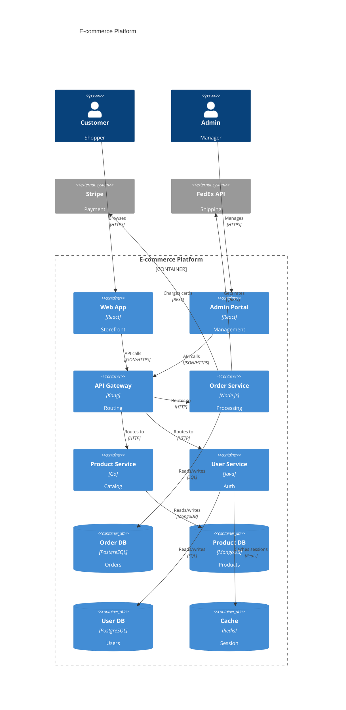
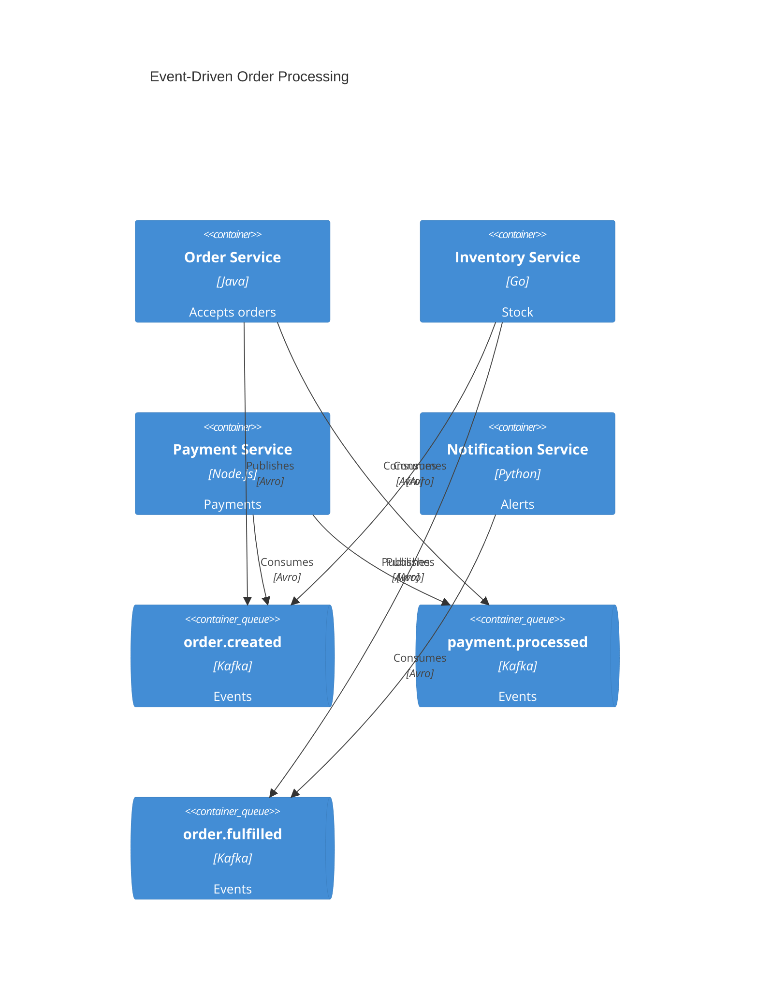

# C4 Mermaid Diagramming

## Workflow
1. **Scope**: Determine C4 level by audience.
2. **Analyze**: Identify components, containers, and relationships.
3. **Generate**: Create Mermaid C4 syntax.
4. **Document**: Write to markdown with context.

## Core Syntax & Configuration

### Structure
```mermaid
diagramType
  definition content
```

- `%%` for comments.
- Parameters fail silently; unknown words break diagrams.

### Frontmatter Config


### Options
- **Themes**: `default`, `forest`, `dark`, `neutral`, `base`.
- **Layouts**: `dagre` (default), `elk`, `tidy-tree`, `cose-bilkent`.
- **Look**: `classic`, `handDrawn`.

## C4 Diagram Levels

| Level | Type | Audience | Focus | Requirement |
|-------|-------------|----------|-------|----------------|
| 1 | **C4Context** | Everyone | System + external actors | Required |
| 2 | **C4Container** | Technical | Apps, databases, services | Required |
| 3 | **C4Component** | Developers | Internal components | Optional |
| 4 | **C4Deployment** | DevOps | Infrastructure nodes | Production |
| - | **C4Dynamic** | Technical | Numbered request flows | Complex flows |

## C4 Elements

### System Context
- `Person(alias, label, ?descr)`
- `Person_Ext(alias, label, ?descr)`
- `System(alias, label, ?descr)`
- `System_Ext(alias, label, ?descr)`
- `SystemDb(alias, label, ?descr)`
- `SystemDb_Ext(alias, label, ?descr)`
- `SystemQueue(alias, label, ?descr)`
- `SystemQueue_Ext(alias, label, ?descr)`

### Containers
- `Container(alias, label, ?techn, ?descr)`
- `Container_Ext(alias, label, ?techn, ?descr)`
- `ContainerDb(alias, label, ?techn, ?descr)`
- `ContainerDb_Ext(alias, label, ?techn, ?descr)`
- `ContainerQueue(alias, label, ?techn, ?descr)`
- `ContainerQueue_Ext(alias, label, ?techn, ?descr)`

### Components
- `Component(alias, label, ?techn, ?descr)`
- `Component_Ext(alias, label, ?techn, ?descr)`
- `ComponentDb(alias, label, ?techn, ?descr)`
- `ComponentDb_Ext(alias, label, ?techn, ?descr)`
- `ComponentQueue(alias, label, ?techn, ?descr)`
- `ComponentQueue_Ext(alias, label, ?techn, ?descr)`

### Deployment
- `Deployment_Node(alias, label, ?type, ?descr) { ... }`
- `Node(alias, label, ?type, ?descr) { ... }`
- `Node_L(alias, label, ?type, ?descr) { ... }`
- `Node_R(alias, label, ?type, ?descr) { ... }`

## C4 Relationships

### Basic & Bidirectional
- `Rel(from, to, label, ?techn, ?descr)`
- `BiRel(from, to, label, ?techn)`

### Directional
- `Rel_U` / `Rel_Up` (Up)
- `Rel_D` / `Rel_Down` (Down)
- `Rel_L` / `Rel_Left` (Left)
- `Rel_R` / `Rel_Right` (Right)
- `Rel_Back(from, to, label)`

### Dynamic
- `RelIndex(index, from, to, label)` (Index ignored; order is sequential).

## C4 Boundaries
- `Enterprise_Boundary(alias, label) { ... }`
- `System_Boundary(alias, label) { ... }`
- `Container_Boundary(alias, label) { ... }`
- `Boundary(alias, label, ?type) { ... }`

## Styling & Layout

### Element Style
`UpdateElementStyle(elementAlias, $bgColor, $fontColor, $borderColor, $shadowing, $shape)`

### Relationship Style
`UpdateRelStyle(from, to, $textColor, $lineColor, $offsetX, $offsetY)`

### Layout Config
`UpdateLayoutConfig($c4ShapeInRow, $c4BoundaryInRow)`
- `$c4ShapeInRow`: Default 4.
- `$c4BoundaryInRow`: Default 2.

### Parameter Syntax
- **Positional**: `Rel(a, b, "label", "tech")`
- **Named**: `UpdateRelStyle(a, b, $offsetX="-40", $lineColor="blue")`

## Examples

### C4Context


### C4Container


### C4Component


### C4Dynamic


### C4Deployment


### E-commerce Microservices


### Event-Driven Architecture


### AWS Deployment
```mermaid
C4Deployment
  title Production Deployment - AWS

  Deployment_Node(cdn, "CloudFront", "CDN") {
    Container(static, "Static Assets", "S3", "HTML/CSS/JS")
  }

  Deployment_Node(vpc, "VPC", "10.0.0.0/16") {
    Deployment_Node(publicSubnet, "Public Subnet", "10.0.1.0/24") {
      Deployment_Node(alb, "Application Load Balancer", "ALB") {
        Container(lb, "Load Balancer", "AWS ALB", "Routes traffic")
      }
    }

    Deployment_Node(privateSubnet, "Private Subnet", "10.0.2.0/24") {
      Deployment_Node(ecs, "ECS Cluster", "Fargate") {
        Container(api1, "API Instance 1", "Node.js", "REST API")
        Container(api2, "API Instance 2", "Node.js", "REST API")
      }

      Deployment_Node(rds, "RDS", "Multi-AZ") {
        ContainerDb(primary, "Primary DB", "PostgreSQL", "Main database")
        ContainerDb(replica, "Read Replica", "PostgreSQL", "Read scaling")
      }
    }
  }

  Rel(cdn, alb, "Forwards requests", "HTTPS")
  Rel(lb, api1, "Routes to", "HTTP")
  Rel(lb, api2, "Routes to", "HTTP")
  Rel(api1, primary, "Writes to", "JDBC")
  Rel(api2, replica, "Reads from", "JDBC")
```

## Mermaid Limitations
Unsupported PlantUML C4 features:
- `sprite`, `tags`, `link`, `Legend`
- `AddElementTag`, `AddRelTag`
- `RoundedBoxShape`, `EightSidedShape`
- `DashedLine`, `DottedLine`, `BoldLine`
- Layout directives (`Lay_U`, `Lay_D`, `Lay_L`, `Lay_R`)

## Best Practices
- **Iterate**: Start simple $\rightarrow$ add detail.
- **Completeness**: Include Name, Type, Technology, and Description for every element.
- **Precision**: Use `%%` comments, technology labels (e.g., "gRPC"), and action verbs for arrows.
- **Clarity**: Use titles, meaningful aliases, and concise descriptions (<50 chars).
- **Complexity**: Keep <20 elements per diagram; split if needed. One diagram per file.

## Common Pitfalls
- Avoid `{}` in comments.
- Validate syntax in Mermaid Live.
- Ensure all critical relationships are documented.

## References
- `references/c4-syntax.md` - Syntax reference.
- `references/common-pitfalls.md` - Anti-patterns.
- `references/advanced-patterns.md` - Microservices/Event-driven/Deployment.
